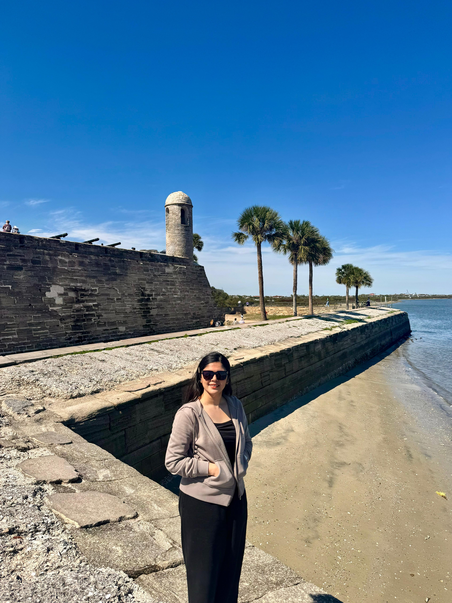

::: {.profile-layout}

::: {.profile-bio}

I am a Ph.D. student at Florida State University.

My previous research includes work on immigration and labor-market outcomes, women’s leadership, and economic decision-making over the life cycle.

Before joining FSU, I earned a Master of Science in Economics from Utah State University. I also hold bachelor’s and master’s degrees in Economics from Jahangirnagar University.

[Google Scholar](https://scholar.google.com/citations?user=aCZuH7oAAAAJ&hl=en) · [ORCID](https://orcid.org/0009-0005-3935-3182) · [Email](mailto:bb25f@fsu.edu)

:::

::: {.profile-photo}

{fig-alt="Barna Bose beside the waterfront in St. Augustine, Florida"}

:::

:::