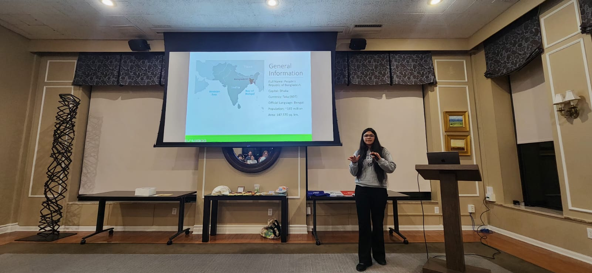

::: {.publications-banner}
# Teaching
:::

::: {.publications-content}

::: {.profile-layout}

::: {.teaching-text}

## As a lecturer

**Bangladesh University of Professionals**

- Economic Process and Institution — Spring 2023.
- Economics of Poverty, Gender and Inequality — Spring 2023.
- Agricultural Economics — 2021–2022.
- Principles of Economics — 2020–2022.
- Development Economics — Fall 2020.

## As a teaching assistant

**Florida State University**

- Introduction to International Relations — Fall 2025 and Spring 2026.

**Utah State University**

- Intermediate Microeconomics — Fall 2024 and Spring 2025.
- Women in Business — Spring 2024.

:::

::: {.profile-photo}

{fig-alt="Barna Bose in St. Augustine, Florida"}

:::

:::

:::